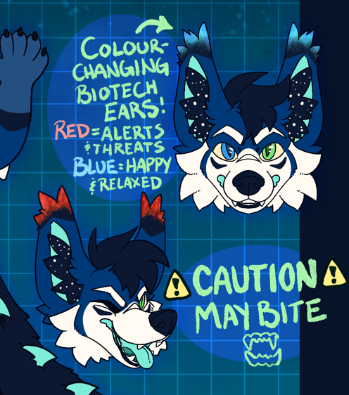

# API Design

### VRC Intergration

RX Request Example (OSC)

| Param        | Var Type   | Example Value | 
| ------------ | ---------- | ----------    |
| /avatar/parameters/nettuffs_ltuff_r | Int |  255
| /avatar/parameters/nettuffs_ltuff_g | Int |  255
| /avatar/parameters/nettuffs_ltuff_b | Int |  255
| /avatar/parameters/nettuffs_rtuff_r | Int |  255
| /avatar/parameters/nettuffs_rtuff_g | Int |  255
| /avatar/parameters/nettuffs_rtuff_b | Int |  255
| /avatar/parameters/nettuffs_state_code | Int |  005 = Caution may bite!
| /avatar/parameters/nettuffs_blink | Bool |  true
| /avatar/parameters/nettuffs_fade | Bool |  true
| /avatar/parameters/nettuffs_fade_secs | Int |  2

### Resonite Intergration

> Unsupported as of 5/14/2024: Resonite requires JSON Parsing

### NetFloof (Previously FreakSuit API) Intergration
NetFloof is a protocol written with REST API and Socket.IO to communicate with fursuit information from api.lynix.ca this Data can be Vectorized RGB colors, motor movements or audio link data.

RX Request Example

```json
{
    "ltuff": {
        "r": 255,
        "g": 0,
        "b": 0,
    },
    "rtuff": {
        "r": 255,
        "g": 0,
        "b": 0,
    },
    "blink": true,
    "fade": true,
    "fade_secs": 2,
    "state_code": 005,
    "state_msg": "Caution may bite!"
}
```

# Reference

This is the refsheet reference for the system

